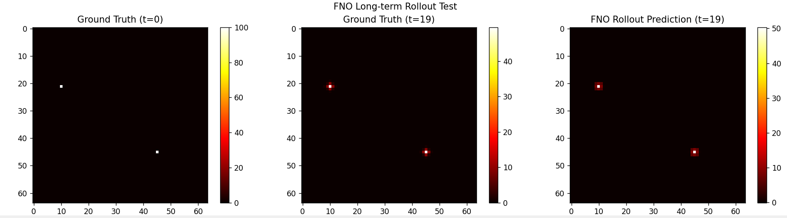
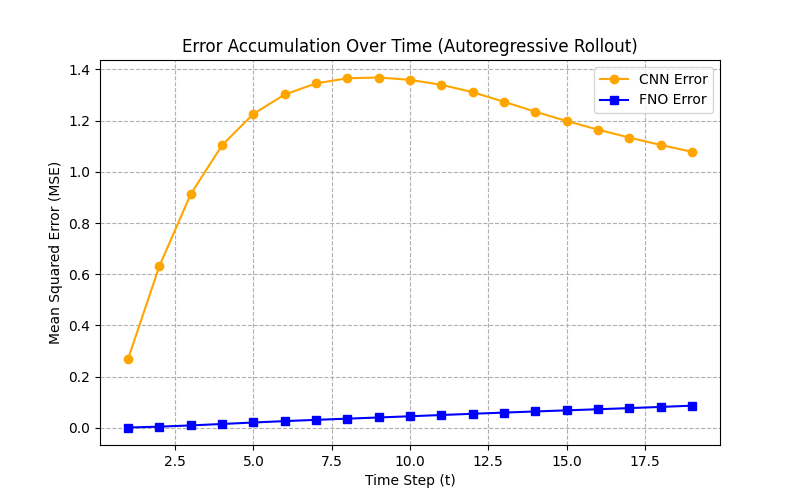
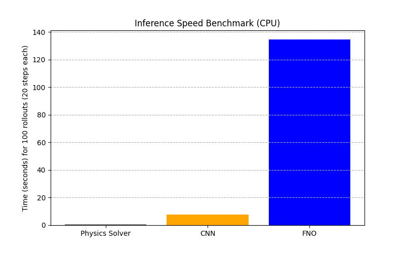

# [Prototype] Neural Surrogate Modeling for the 2D Heat Equation

[](https://www.python.org/)
[](https://pytorch.org/)
[](https://github.com/)

>  This is an active research prototype. The codebase is intended for experimentation and benchmarking, not for production deployment.

---

## Overview

Numerical solvers for Partial Differential Equations (PDEs) remain computationally expensive for tasks requiring thousands of forward passes (e.g., optimization, inverse design). 

This prototype explores replacing the numerical solver for the **2D Heat Equation** with trained neural surrogates. The objective is to benchmark speed and accuracy trade-offs between standard architectures and modern neural operators.

---

## Methodology

### 1. Data Generation
A batched, finite-difference numerical solver generates ground-truth data:

`∂T/∂t = α∇²T`

- **Input:** Initial temperature distribution on a 64×64 grid (random heat sources).
- **Output:** Temperature distribution at the next time step (t+1).
- **Dataset Size:** 10 simulations × 20 time steps (200 training samples).

### 2. Baseline Model: CNN
A standard Encoder-Decoder Convolutional Neural Network acts as the baseline surrogate.

- **Strength:** Effective for single-step predictions.
- **Limitation:** Error accumulation during long-term autoregressive rollouts, resulting in spatial blurring and checkerboard artifacts.

### 3. State-of-the-Art: Fourier Neural Operator (FNO)
The FNO learns mappings between infinite-dimensional function spaces using integral operators in the Fourier domain.

- **Strength:** Captures global dependencies, leading to stable long-term rollouts.

### 4. Large-Scale HPC Benchmark (Pending)

**Status:**  *Scheduled for HPC cluster run (available in ~3 weeks).*

This prototype is currently being scaled up to 40,000+ simulations on a High-Performance Computing (HPC) cluster. The upcoming benchmark will test:

- **Massive Data Scaling:** Training on 40,000 simulations with varying diffusion coefficients.
- **Long-Term Prediction:** Extending rollout predictions to 100 time steps.
- **Zero-Shot Resolution Scaling:** Testing the FNO's ability to generalize to 128x128, 256x256, and 512x512 grids *without retraining*.

Results and scaling graphs will be added to the `results/` folder upon completion of the cluster run.

---

## Results

### 1. Long-Term Rollout (t=0 to t=19)
The figure below compares ground truth against the FNO prediction after 19 autoregressive steps:



### 2. Error Accumulation Over Time
The graph below tracks the Mean Squared Error (MSE) at each time step during a 20-step rollout. 



*Observation:* The CNN error grows significantly as the rollout progresses, while the FNO maintains a low, stable error rate.

### 3. Inference Speed Benchmark
The bar chart below compares the time required to run 100 rollouts (20 steps each) for the Physics Solver, the CNN, and the FNO on a standard CPU.



*Observation:* The FNO is orders of magnitude faster than the traditional numerical solver, demonstrating the practical value of neural surrogates.

---

## Getting Started

### Prerequisites
- Python 3.8+
- PyTorch
- Matplotlib
- neuraloperator

### Installation

```bash
pip install torch matplotlib neuraloperator

```

### Running the Models

1. Generate simulation data:
   ```
   python data_generator_cpu.py
   ```

2. Train the CNN baseline:
   ```
   python train_cnn.py
   ```

3. Train the FNO model:
   ```
   python train_fno.py
   ```

4. Run the long-term rollout test:
   ```
   python test_rollout.py
   ```

5. Run speed and error benchmarks:
   ```
   python benchmark.py
   ```

---


## Roadmap

- [x] Prototype CNN and FNO on small dataset (10 simulations, 20 time steps)
- [x] Benchmark inference speed vs. traditional solver
- [x] Error accumulation analysis (CNN vs FNO)
- [ ] HPC run: Scale to 40,000+ simulations
- [ ] HPC run: Zero-shot resolution scaling (64 → 512)
- [ ] Update results with scaling graphs and 512x512 prediction demo


